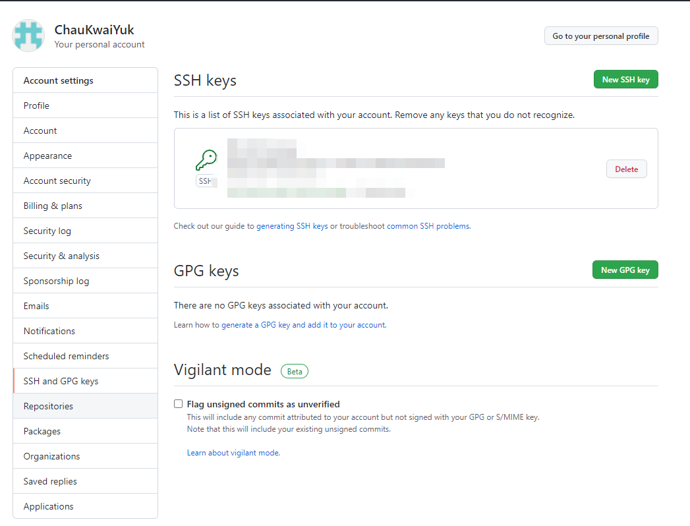

解决一台电脑生成多份ssh密钥，映射多个GitHub账户。如自己的个人账户和公司账户。

1. 通过命令`ssh-key -t rsa -C "your_email@example.com" -f ~/.ssh/id_rsa_example`，会在`~/.ssh`目录下生产不同的密钥。
   如：`ssh-key -t rsa -C "mine@example.com" -f ~/.ssh/id_rsa_mine`
   		`ssh-key -t rsa -C "company@example.com" -f ~/.ssh/id_rsa_company`
2. 在`~/.ssh`目录下，可以看到个人账户对应的私钥文件`id_rsa_mine`、公钥文件`id_rsa_mine.pub`，和公司账户对应的私钥`id_rsa_company`，`id_rsa_company.pub`
3. 分别在不同账户上添加对应的公钥信息，
4. 通过ssh-add添加密钥至ssh-agent
   命令：`ssh-add ~/.ssh/id_rsa_example;`
   示例：`ssh-add ~/.ssh/id_rsa_mine; ssh-add ~/.ssh/id_rsa_company;`

