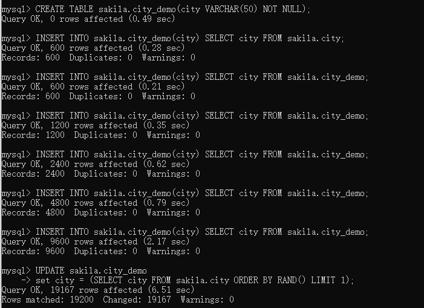
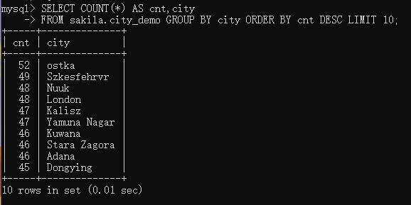
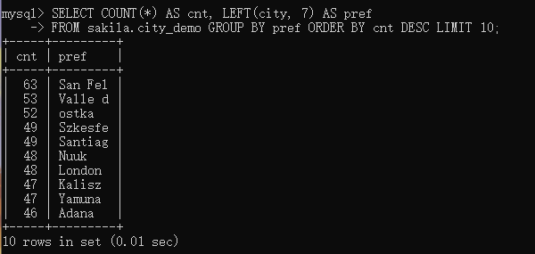
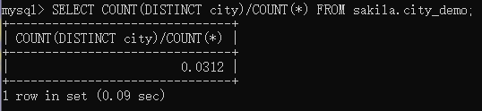
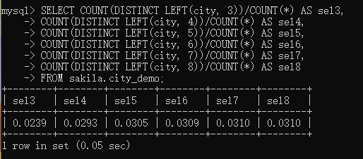

## **索引的优点**

索引可以让服务器快速地定位到表的指定位置。但是这也并不是索引的唯一作用，到目前为止可以看到，根据创建索引的数据结构不同，索引也有一些其他的附加作用。

1. 索引大大减少了服务器需要扫描的数据量
2. 索引可以帮助服务器避免排序和临时表
3. 索引可以将随机I/O变为顺序I/O


## **索引策略**

### **独立的列**

指索引列不能是表达式的一部分，也不能是函数的参数。

例如：

```mysql
SELECT actor_id FROM sakila.actor WHERE actor_id + 1 = 5;
```

虽然能看出WHERE中的表达式等价于`actor_id = 4`，但是MySQL无法自动解析这个方程式。我们要养成简化WHERE条件的习惯，始终将索引列单独放在比较符号的一侧。

```mysql
SELECT actor_id FROM sakila.actor WHERE actor_id = 4;
```


### **前缀索引和索引选择性**

有时候需要索引很长的字符列，这会让索引变得大且慢。

通常可以索引开始的部分字符，这样可以大大节约索引空间，从而提高索引效率。但这样也会降低索引的选择性。索引的选择性是指，**不重复的索引值（也称为基数，cardinality）和数据表的记录总数（#T）的比值**，范围从1/#T到1之间。**索引的选择性越高则查询效率越高**，因为选择性高的索引可以让MySQL在查找时过滤掉更多的行。唯一索引的选择性是1，这是最好的索引选择性，性能也是最好的。

对于**BLOB**、**TEXT**或者很长的**VARCHAR**类型的列，**必须**使用前缀索引，因为MySQL不允许索引这些列的完整长度。

诀窍在于要选择足够长的前缀以保证较高的选择性，同时又不能太长（以便节约空间）。前缀应该足够长，以使得前缀索引的选择性接近于索引的整个列。换句话说，就是前缀的“基数”应该接近于完整列的“基数”。

为了决定前缀的合适长度，需要找到最常见的值的列表，然后和最常见的前缀列表进行比较。

通过示例数据库`sakila`创建示例表`city_demo`

```mysql
CREATE TABLE sakila.city_demo(city VARCHAR(50) NOT NULL);
```

插入数据

```mysql
INSERT INTO sakila.city_demo(city) SELECT city FROM sakila.city;
```

重复下面的语句5次

```mysql
INSERT INTO sakila.city_demo(city) SELECT city FROM sakila.city_demo;
```

使用`RAND()`随机分配

```mysql
UPDATE sakila.city_demo
set city = (SELECT city FROM sakila.city ORDER BY RAND() LIMIT 1);
```




现在有了示例数据集，我们找到最常见的城市列表：

```mysql
SELECT COUNT(*) AS cnt,city
FROM sakila.city_demo GROUP BY city ORDER BY cnt DESC LIMIT 10;
```




现在查找最频繁出现的城市的前缀，先从3个前缀字母开始。

```mysql
SELECT COUNT(*) AS cnt, LEFT(city, 3) AS pref
FROM sakila.city_demo GROUP BY pref ORDER BY cnt DESC LIMIT 10;
```


每个前缀都比原来的城市出现的次数更多，因此唯一前缀比唯一城市要少很多。然后我们增加前缀长度，直到这个前缀的选择性接近完整列的选择性。通过不断添加前缀长度，可以发现前缀长度到达7的时候比较合适。

```mysql
SELECT COUNT(*) AS cnt, LEFT(city, 7) AS pref
FROM sakila.city_demo GROUP BY pref ORDER BY cnt DESC LIMIT 10;
```




计算合适的前缀长度的另外一个办法就是通过计算完整列的选择性，并使前缀的选择性接近于完整列的选择性。

下面显示如何计算完整列的选择性：

```mysql
SELECT COUNT(DISTINCT city)/COUNT(*) FROM sakila.city_demo;
```



接下来，针对不同前缀长度进行计算。

```mysql
SELECT COUNT(DISTINCT LEFT(city, 3))/COUNT(*) AS sel3,
COUNT(DISTINCT LEFT(city, 4))/COUNT(*) AS sel4,
COUNT(DISTINCT LEFT(city, 5))/COUNT(*) AS sel5,
COUNT(DISTINCT LEFT(city, 6))/COUNT(*) AS sel6,
COUNT(DISTINCT LEFT(city, 7))/COUNT(*) AS sel7,
COUNT(DISTINCT LEFT(city, 8))/COUNT(*) AS sel8
FROM sakila.city_demo;
```



可以看到，当前缀长度到达7的时候，再增加前缀长度，选择性提升的幅度已经很小，而且也接近完整列的选择性。